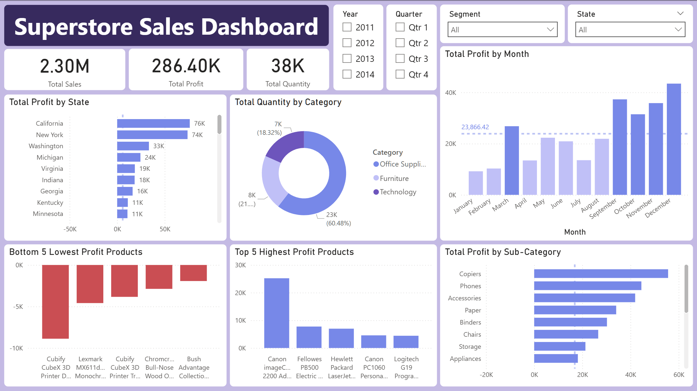
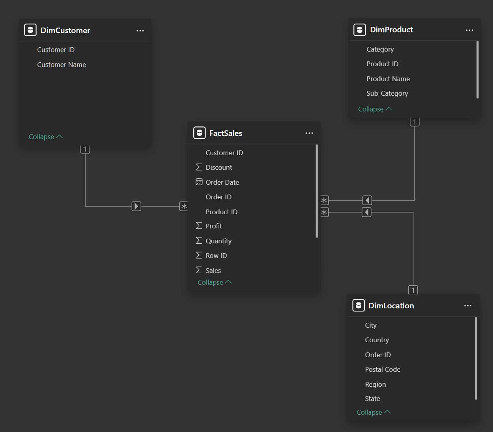
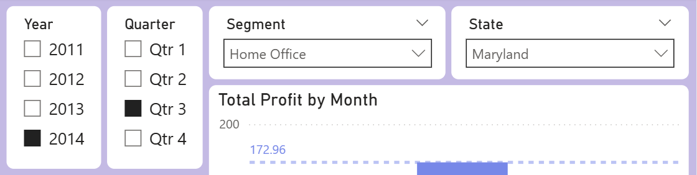
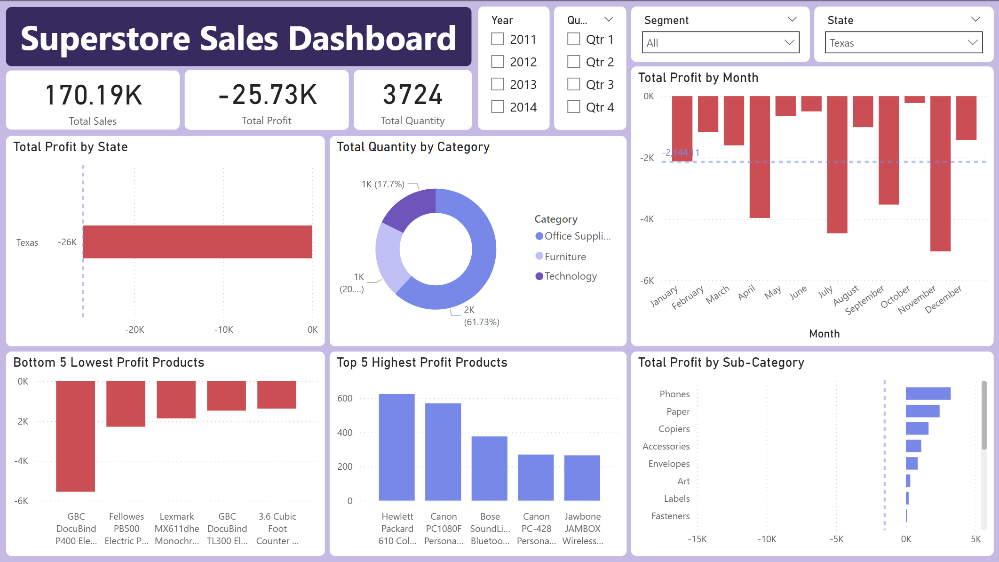
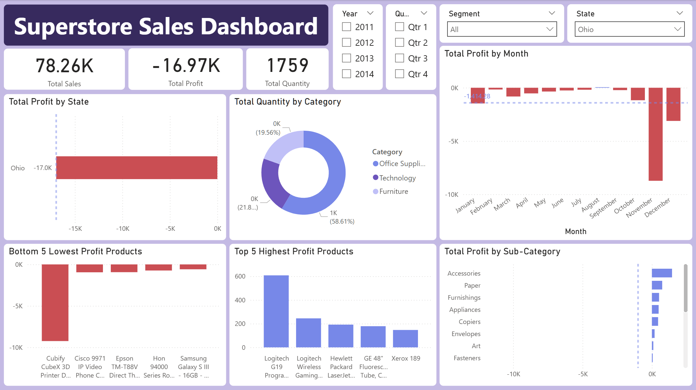
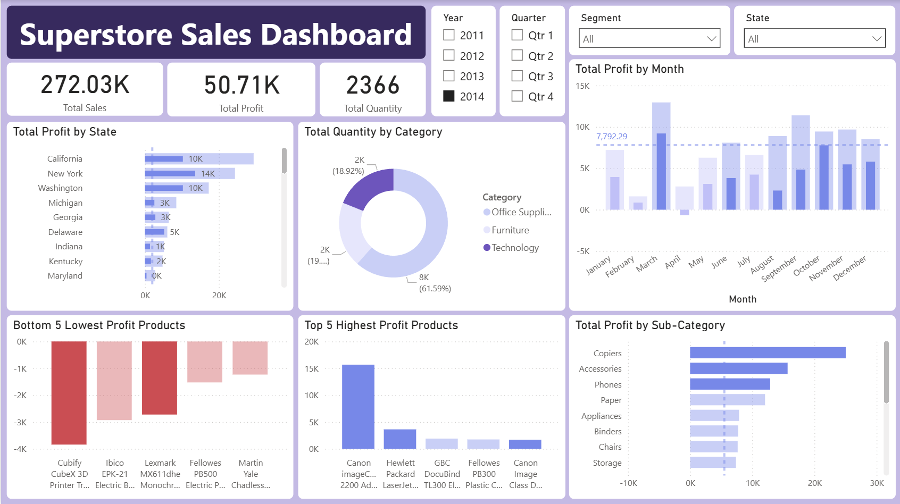
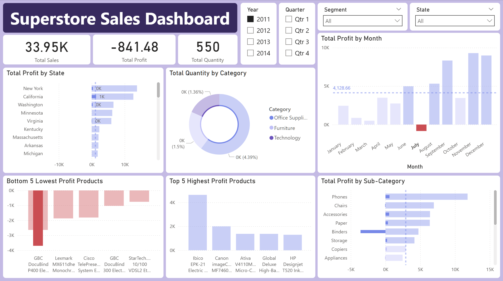

# Retail Sales Exploratory Data Analysis

## Introduction
This is a project designed to demonstrate my skills in exploratory data analysis & delivering key visualizations and actionable insights through a Power BI dashboard on a sample set of sales data from a superstore. The final dashboard is displayed below, and I'll go over my findings and recommendations for this superstore in depth. I am a Microsoft Certified: Power BI Data Analyst Associate, and this is me putting the skills from that certification into practice!

## The Dataset
The dataset I used is the "Superstore Sales" dataset from [Kaggle](https://www.kaggle.com/datasets/ishanshrivastava28/superstore-sales). This dataset contains 
a diverse set of daily information across a four-year period (2011-2014) on product sales, including sale locations, product descriptions and categories, and order and shipping dates, among others. In total, this dataset contains just under 10,000 total order records over this four year period and has a lot of useful information that can be used.

## Data Structuring and Cleaning
Most of the work done prior to analysis of this data was to split the original data into a fact table and several dimension tables in a Star Schema. In Power BI, this helps the performance of visuals and enable better filtering, grouping, and summarization. Below is the schema I created from the original table:

However, outside of this, there were some minor modifications and data cleaning to be performed. For example, I needed to utilize a Change Type using Locale step to convert the Order Date and Ship Date to the proper type, as they were in the format dd-mm-yyyy, which Power Query was unable to automatically parse.

## Dashboard Visuals & Initial Insights

### Cards
I added three main cards underneath the title displaying three key metrics, the total sales for the selected periods, the total profit, and the total quantity of sales. There isn't too much interesting from this, but it can be seen through these cards and selecting the years that the total profits and total quantity of sales have consistently gone up year-over-year. Interestingly, the total sales figure went down between 2011 and 2012, but profits still increased.

### Slicers
I opted to add four slicers in total, selecting the year, quarter, segment (Consumer, Corporate, and Home Office), and the state the sale was made in.

### Total Profit by State
From this data, sales were made across 42 states in total (including the District of Columbia as one). While most states were profitable, with the most profit being produced in California and New York, there were a number of states that consistently produced a net loss on profit, with Texas sales consistently having the largest losses. Further investigation into sales in these states would be a good idea for this store, and that analysis is something I dive further into in the following section.

### Total Quantity by Category
This visual represents the distribution of categories that the company sells, with the vast majority of the company's sales being in the category of office supplies.

### Highest and Lowest Profit Products
These visuals allow a business to immediately see which products are producing the most profit for the company and which are producing the heaviest losses. This could allow the company to negotiate better deals with the manufacturers of the least profitable products or to cut those products from their lineup. Over a longer time period than this dataset, these visuals could also allow a company to see emerging trends or shifts (i.e. the top 5 profitable products might all be phones in the latest year).

### Total Profit by Month
This allows for analysis of the most profitable times throughout each year of data, and across all years, the end of the year is consistently the most profitable time for this superstore, with Quarter 4 having the highest average profit of $36,910.44 and the month of December having the highest average profit of all months at $43,436.13.

### Total Profit by Sub-Category
This gives a breakdown of profits gained or lost by each sub-category of product. For this superstore, the products that produce the most profit are Copiers, Phones, and Accessories, while Tables produce the largest net loss.

### Conditional Formatting
On the Profits by State, Subcategory and Month, I've applied custom conditional formatting using a few DAX measures. This formatting highlights the profits above average with the default purple color, profits below the average but still positive with a lighter purple, and negative profits in red. These are calculated the same way as the average line overlay on each graph.

### Theming
Since I had no insight into what company or store this was based on the data, I just went with a simple custom theme based around a set of colors that I liked while remaining clear and easy to interpret. In a real-world situation, I'd base the theme, coloring, and font around the company's. The theme's json file is also contained in this repository.

## Key Insights & Recommendations

### Poor Sales in Texas
Texas sales consistently produced the lowest profits for this Superstore, and filtering the dashboard to show Texas sales only shows us this!

These figures are bad across the board, with the Texas sales losing an average of $2144.11 per month! Investigating the bottom 5 lowest profit products and the profits by subcategory reveals that the heaviest losses are coming from document binders. Across all states, the subcategory of binders actually produces profits above the average subcategory, so I'd recommend that this company investigates the sales of binders within Texas, perhaps the losses are due to heavy shipping costs and could be helped by considering different shipping centers or opening a new one.

### Poor Sales in Ohio
Ohio sales consistently produced the second lowest profits for this Superstore, and again filtering the dashboard for Ohio displays the following:

The Ohio sales lose an average of $1414.28 per month, and investigating the bottom 5 lowest profit products and the profits by subcategory reveals something quite interesting! There is a single product that by far produced the highest losses for Ohio, which was the Cubify CubeX 3D Printer Dual Print Head. Further investigation reveals that there were only three total orders for this product, all in Ohio, but the first two orders were shipments of multiple printers, at a 70% discount! These heavy losses were caused by these bulk orders of several printers at the heavy 70% discount. 
This may have already been rectified, as the last order was the latest and produced a profit with only a 20% discount applied, but I'd still investigate the sale of these printers and if they're worth keeping in the store's lineup with how rarely they were sold and how much of a loss they produced when they were sold! There is also a triple-head variant of the same printer, and either it or the dual-head variants are the lowest profit products each year after 2011

### Category Sales
This Superstore splits all of its offerings into three categories, Technology, Office Supplies, and Furniture. While both the total profits and total quantity increased, the distribution of each category remained roughly the same each year, with office supplies being the majority of their offerings. However, filtering by each category reveals that despite only being roughly 18% of the Superstore's offerings each year, it consistently produces more profit each year after 2011. (50.71K vs. 39.78K in 2014).
 
With the benefit of hindsight we know that this trend continued to grow massively past 2014, but even with this data the trend is already visible. I'd recommend that this Superstore change their quantity distribution, shifting away from office supplies and hosting more technology offerings.

### Discount's Impact on Profits
While this visual didn't make it to the dashboard, using the key influencers visual, I found that in the year 2014, profits increase with a discount of 15% or less, while profits decrease with a discount of 40% or above. This finding along with the other recommendations would be more appropriate for a report, but this dashboard allows its user to quickly discover any notable problems and issues for further analysis.

## Summary & Conclusion
I'm quite happy with how the final dashboard turned out, and I believe it's functionality would be quite useful and easy-to-parse for someone such as the Superstore manager. As a last example of its usage, you can very quickly see what happened during a bad month that lost money by highlighting it. 

Highlighting July of 2011 shows that one specific document binder produced heavy losses that month and from there analyzing what happened would be simple. I hope that this project serves as a proper demonstration of my skills within Power BI and my ability to perform data analysis to produce actionable insights.

